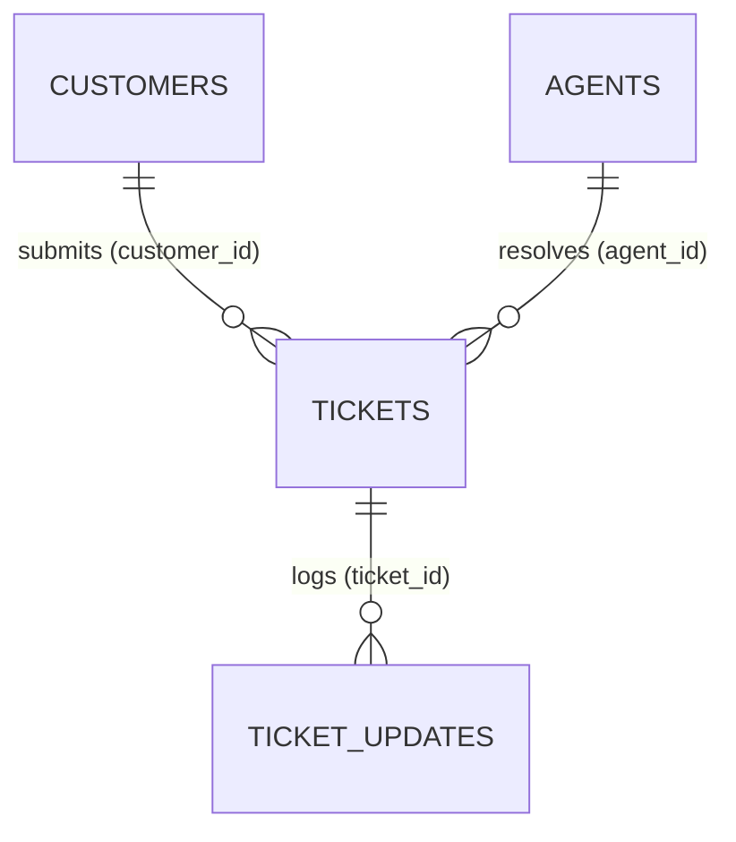
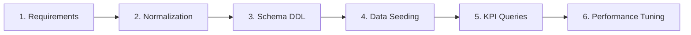
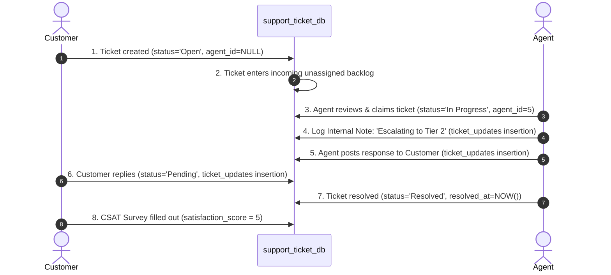

# 🎓 Support Ticket Analysis System: Interview Prep & Project Guide

> **This guide serves as your comprehensive handbook for presenting the Support Ticket Analysis System in job interviews. It connects database engineering with SaaS operations (Zendesk/Jira workflows), providing you with a high-impact narrative to showcase to recruiters and engineering managers.**

---

## 📂 Table of Contents
1. [🌟 Project Overview & The Elevator Pitch](#-project-overview--the-elevator-pitch)
2. [📐 System Architecture & Relational Schema Design](#-system-architecture--relational-schema-design)
3. [🚀 The 6-Stage Project Development Workflow](#-the-6-stage-project-development-workflow)
4. [🎟️ The Operational Support Ticket Lifecycle](#-the-operational-support-ticket-lifecycle)
5. [💎 Showcase Queries to Walk Through with an Interviewer](#-showcase-queries-to-walk-through-with-an-interviewer)
6. [🎙️ Master the Interview: Top Technical & Domain Q&A](#-master-the-interview-top-technical--domain-qa)

---

## 🌟 Project Overview & The Elevator Pitch

### The Problem It Solves
In modern SaaS enterprises, customer support is a goldmine of operational data. However, support teams often struggle with **backlog clutter, neglected queues, unassigned tickets, SLA breaches**, and **agent burnout**. 

The **Support Ticket Analysis System** is a normalized, high-performance relational database modeled specifically in **MySQL** to mirror enterprise customer support workflows (e.g., Zendesk, Salesforce Service Cloud, or Jira Service Management). It acts as both a transactional ticketing database and an analytical reporting dashboard that translates raw operational records into actionable business decisions.

### 30-Second Elevator Pitch for Interviews
> *"I designed and implemented a production-grade **Customer Support Ticketing Database** in MySQL that models real-world SaaS helpdesk workflows. By partitioning data into normalized tables for Customers, Agents, Tickets, and Audit Trails, I constructed an analytical reporting engine. My system tracks real-time team performance metrics, detects critical SLA breach warnings, audits unaddressed customer backlogs, and handles automatic workload re-routing. It demonstrates my ability to write optimized SQL and apply a data-driven, customer-centric operations mindset to solve real organizational bottlenecks."*

---

## 📐 System Architecture & Relational Schema Design

This system is built with a highly normalized, robust, and performant schema designed to enforce **referential integrity**, prevent **redundancy**, and optimize **analytical query execution times**.



### Table Breakdown & Design Decisions

| Table Name | Primary Role | Key Design Decision | Why It Matters |
| :--- | :--- | :--- | :--- |
| **`customers`** | Stores client contact profiles | `UNIQUE` constraint on `email` | Prevents duplicate user registrations, keeping customer contact data clean. |
| **`agents`** | Profiles team members & technical levels | Check constraint `chk_agent_tier (1, 2, 3)` | Restricts values to valid support tiers (Tier 1 General, Tier 2 Technical, Tier 3 Escalation). |
| **`tickets`** | Core transactional ticket records | `ON DELETE RESTRICT` on `customer_id` | Prevents deletion of a customer profile if they have active tickets, preserving audit history. |
| **`tickets`** | Core transactional ticket records | `ON DELETE SET NULL` on `agent_id` | If an agent leaves or their account is deactivated, their active tickets automatically revert to `NULL` (backlog) so they can be re-routed, instead of failing or orphan-blocking. |
| **`ticket_updates`**| Conversation audit & interaction log | `ON DELETE CASCADE` on `ticket_id` | If a support ticket is permanently archived/purged, all corresponding chat logs and notes are automatically cleaned up, preventing orphan data rows. |

### Indexing & Optimization Strategy
To prepare this schema for high-volume enterprise databases, strategic **B-Tree Indexes** were added to bypass slow full-table scans during dashboard updates:
*   `idx_customer_email`: For instantaneous customer profile retrieval when they contact support.
*   `idx_tickets_status` & `idx_tickets_priority`: Drastically speeds up real-time queues filtering for "Urgent" or "Open" tickets.
*   `idx_tickets_agent_id` & `idx_tickets_customer_id`: Optimizes standard `JOIN` operations across tables.
*   `idx_updates_ticket_id`: Instantly pulls the chronological conversation stream when an agent loads a ticket page.

---

## 🚀 The 6-Stage Project Development Workflow

When explaining your workflow to an interviewer, present it as a structured lifecycle rather than just writing SQL queries. This shows your maturity as a developer.



1.  **Requirement Gathering & Domain Research**: Investigated real-world SaaS customer support workflows (Zendesk / Jira Service Desk) to isolate the core metrics that keep support teams efficient: Customer Satisfaction (CSAT), Service Level Agreements (SLAs), and queue counts.
2.  **Relational Modeling & Normalization (3NF)**: Designed the logical schema. Separated transactional ticket states from the continuous chronological audit trail (`ticket_updates`), achieving Third Normal Form (3NF) to eliminate data modification anomalies.
3.  **DDL Schema Definition**: Wrote DDL scripts in `schema.sql`. Declared primary keys, foreign keys, explicit check constraints, and default timestamp values.
4.  **Operational Data Seeding**: Populated `data.sql` with a highly realistic, chronological scenario simulating 10 customers, 5 agents with differing tiers, 30 tickets ranging across multiple priorities/categories, and 30+ conversation logs tracking resolution paths.
5.  **Analytical Query Design**: Developed the 15 analytical reporting queries in `queries.sql` to calculate support health, agent performance, SLA warnings, and process bottlenecks.
6.  **Performance Tuning**: Analyzed query plans, identified high-filtering columns, and applied targeted indexes to minimize lookup times.

---

## 🎟️ The Operational Support Ticket Lifecycle

To speak confidently about support analytics, you must understand how a ticket moves through the database tables dynamically:



---

## 💎 Showcase Queries to Walk Through with an Interviewer

These are the three most impressive, high-value queries in the system. Walk the interviewer through the **business problem**, the **technical execution**, and the **business value** of each.

### 1. High-Impact SLA Breach Warnings
*   **The Business Problem**: Critical clients with "Urgent" or "High" priority issues are waiting in queues, risking contract penalties (SLA violations) and severe customer frustration.
*   **The SQL Query**:
    ```sql
    SELECT 
        t.ticket_id,
        t.subject,
        t.priority,
        t.status,
        t.created_at,
        TIMESTAMPDIFF(HOUR, t.created_at, '2026-05-27 13:00:00') AS open_duration_hours,
        CONCAT(a.first_name, ' ', a.last_name) AS assigned_agent
    FROM tickets t
    LEFT JOIN agents a ON t.agent_id = a.agent_id
    WHERE t.status NOT IN ('Resolved', 'Closed')
      AND t.priority IN ('High', 'Urgent')
    ORDER BY open_duration_hours DESC;
    ```
*   **Technical Highlights**: Uses `TIMESTAMPDIFF(HOUR, ...)` to calculate open queues dynamically. Implements a `LEFT JOIN` to catch tickets that are completely unassigned (displaying `NULL` for agent name).
*   **Interview Talking Point**: *"This query generates a real-time supervisor dashboard. It immediately flags critical customer tickets that have been sitting open for hundreds of hours, allowing operations managers to manually triage and reassign them before contract breaches occur."*

### 2. The "Neglected Backlog" Audit (Zero Touches)
*   **The Business Problem**: Tickets that are officially marked as "Open" or "In Progress" but have slipped completely through the cracks. No internal notes have been left, and no responses have been sent to the customer.
*   **The SQL Query**:
    ```sql
    SELECT 
        t.ticket_id,
        t.subject,
        t.category,
        t.priority,
        t.status,
        t.created_at,
        CONCAT(c.first_name, ' ', c.last_name) AS customer_name
    FROM tickets t
    INNER JOIN customers c ON t.customer_id = c.customer_id
    LEFT JOIN ticket_updates u ON t.ticket_id = u.ticket_id
    WHERE u.update_id IS NULL                     
      AND t.status NOT IN ('Resolved', 'Closed')  
    ORDER BY t.priority DESC, t.created_at ASC;
    ```
*   **Technical Highlights**: Employs an advanced `LEFT JOIN` on `ticket_updates` and filters for `WHERE u.update_id IS NULL`. This is the classic SQL pattern for isolation of *missing occurrences* (records with zero related logs).
*   **Interview Talking Point**: *"An Inner Join would completely hide these tickets. By using a Left Join and filtering for NULLs on the right table, my system isolates exactly which open customer tickets have zero operational history. It acts as an early-warning system for neglected clients."*

### 3. Comprehensive Agent Performance Scorecard
*   **The Business Problem**: Support managers need concrete data to evaluate agent workloads, resolution rates, and client service quality (CSAT scores) for quarterly reviews.
*   **The SQL Query**:
    ```sql
    SELECT 
        CONCAT(a.first_name, ' ', a.last_name) AS agent_name,
        a.tier AS technical_tier,
        COUNT(t.ticket_id) AS total_assigned,
        SUM(CASE WHEN t.status IN ('Resolved', 'Closed') THEN 1 ELSE 0 END) AS total_resolved,
        ROUND(
            (SUM(CASE WHEN t.status IN ('Resolved', 'Closed') THEN 1 ELSE 0 END) * 100.0 / COUNT(t.ticket_id)), 
            2
        ) AS resolution_rate_percentage,
        ROUND(AVG(t.satisfaction_score), 2) AS average_csat_score
    FROM agents a
    LEFT JOIN tickets t ON a.agent_id = t.agent_id
    GROUP BY a.agent_id, a.first_name, a.last_name, a.tier
    ORDER BY average_csat_score DESC, total_resolved DESC;
    ```
*   **Technical Highlights**: Integrates conditional aggregation (`SUM(CASE WHEN...)`), division calculations to calculate ratios, rounding functions, and a `LEFT JOIN` to make sure agents with *zero* currently assigned tickets are still correctly listed rather than hidden.
*   **Interview Talking Point**: *"This scorecard combines volume throughput (total assigned vs resolved) with customer quality (average CSAT). It shows managers at a glance who is handling high caseloads successfully, and who might need additional support training."*

---

## 🎙️ Master the Interview: Top Technical & Domain Q&A

Review these questions to confidently explain your technical decisions and domain expertise.

### Category 1: Database & SQL Engineering Questions

#### Q1: Why did you use `LEFT JOIN` and `IS NULL` to find neglected tickets instead of a `NOT IN` subquery?
> **Strategic Answer:** "While a `NOT IN` subquery is logical, it can be highly inefficient on large tables because MySQL often has to evaluate the subquery repeatedly. A `LEFT JOIN` paired with an `IS NULL` filter is optimized because the database engine can utilize indexes on the join column (`ticket_id`). If the index matches, it keeps the record; if it doesn't, it quickly returns `NULL`. It's a standard, highly performant pattern for detecting non-existence."

#### Q2: What is the purpose of `ON DELETE SET NULL` on the `agent_id` foreign key constraint in the `tickets` table?
> **Strategic Answer:** "In a real support environment, support agents leave the company, change schedules, or delete their accounts. If we used `ON DELETE CASCADE`, deleting an agent would delete every ticket they ever touched—destroying historical customer records and financial audit trails. If we used `ON DELETE RESTRICT`, the database would prevent us from removing the agent until we manually updated hundreds of tickets. By setting `ON DELETE SET NULL`, if an agent account is deleted, all their active tickets automatically revert to unassigned (`NULL`), moving back into the general backlog where other agents can immediately pick them up, preserving database integrity and support operations."

#### Q3: How do the indexing choices you made scale when the ticket volume goes from 30 to 1,000,000?
> **Strategic Answer:** "Without indexes, a query filtering `WHERE status = 'Open'` must perform a **Full Table Scan**, reading every single block on the hard disk (an $O(N)$ operation). I created indexes on key filtering fields like `status` and `priority`. These indexes maintain a B-Tree structure. When data scales, lookup time changes from linear search to logarithmic search ($O(\log N)$). This keeps our operational dashboards loading in milliseconds, even under massive enterprise data loads."

---

### Category 2: Support Operations & Domain Metrics

#### Q4: Why is CSAT (Customer Satisfaction Score) stored in the `tickets` table instead of the `ticket_updates` table?
> **Strategic Answer:** "CSAT is a post-resolution, high-level rating representing the customer's *overall experience* with the resolution of that specific ticket. Storing it in `tickets` makes conceptual sense because it is a 1-to-1 attribute of the ticket. The `ticket_updates` table acts as a transactional history of individual interactions. Storing CSAT in updates would create redundancy and risk data inconsistencies, as a customer only submits one score per ticket resolution."

#### Q5: Explain the "Process Bottleneck" query. How does it help a support team operationalize its backlog?
> **Strategic Answer:** "If a support agent goes on sudden sick leave, vacation, or leaves the company, their assigned tickets can become 'frozen' in their private queue. Customers are left waiting, unaware of the internal staffing issue. My bottleneck query joins the `tickets` and `agents` tables, filtering specifically for active tickets where the assigned agent's status is `'On Leave'`. This instantly shows the operations lead which tickets are blocked by staffing issues, allowing them to re-assign them to active agents within minutes, safeguarding our SLA commitments."

#### Q6: What is a "Repeat Contact Analysis" and why should a support lead care about it?
> **Strategic Answer:** "Repeat contacts happen when a customer submits multiple tickets (e.g., 3 or more) in a short time window. This is a critical red flag. It usually indicates a deep, recurring issue with their account, a buggy product feature, or poor quality in previous resolutions. By grouping tickets by `customer_id` and using `HAVING COUNT(ticket_id) >= 3`, my query isolates these 'power contact' users. Highlighting these accounts allows Customer Success Managers to proactively reach out, perform triage, and prevent complete client churn."

---

### Category 3: Architectural Extensions (Going the Extra Mile)

#### Q7: If you were asked to scale this system to support "Multi-Brand" operations (e.g., managing tickets for three separate software products in one database), how would you modify the schema?
> **Strategic Answer:** "I would introduce a new entity table called `brands` (or `products`) with columns `brand_id`, `brand_name`, and `support_email`. I would then add a `brand_id` foreign key column to both the `customers` and `tickets` tables. This would let us tenant our data safely, routing incoming emails to the correct brand segment, and allowing agents to filter their views by the specific product line they support, all while keeping the primary analytical dashboards unified."

---

> **🏆 Interview Tip:** When discussing this project, emphasize that you didn't just write SQL—you built an **Operational Solution**. Always frame your technical choices around the business value they generate!
