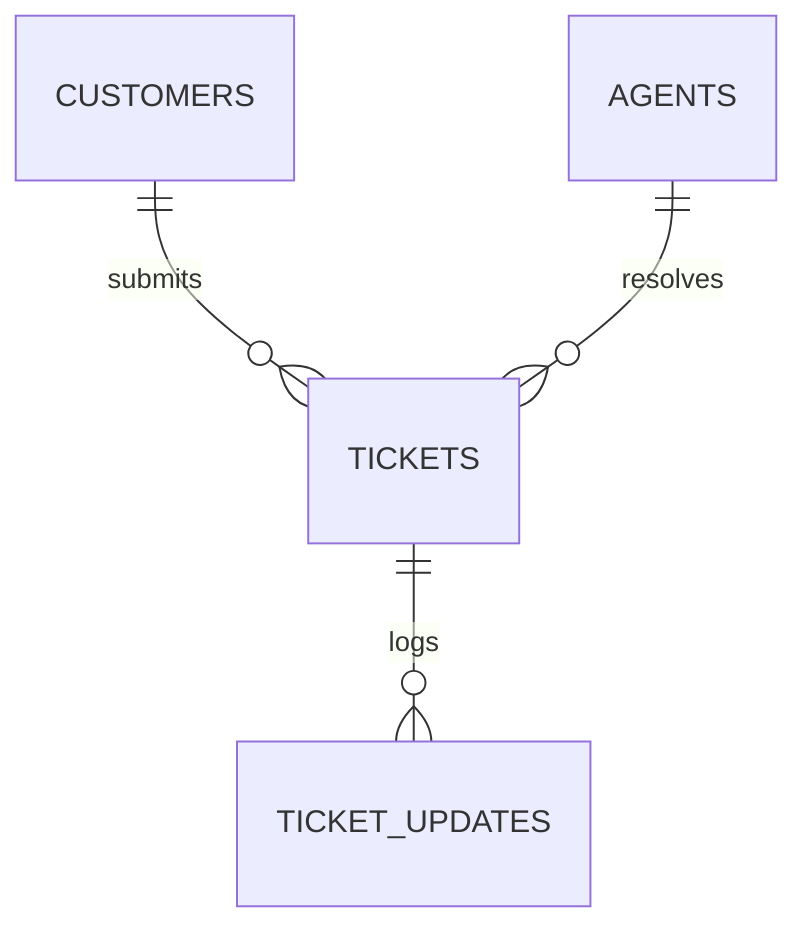

# Support Ticket Analysis System (MySQL)

> **A professional database project demonstrating relational schema design, SQL optimization, and a customer-centric troubleshooting mindset for Support Analyst and Operations roles.**

---

## 🚀 Project Quick Summary

This project simulates a real-world SaaS support ticketing environment (like Zendesk). It contains a normalized MySQL database populated with a realistic operational history of **10 Customers**, **5 Agents**, **30 Tickets**, and **30+ dialogue updates**. 

The system is configured to track critical support metrics such as **Customer Satisfaction (CSAT)**, **SLA Breaches**, **Neglected Backlogs**, and **Agent Productivity**.

---

## 📊 Database Architecture

### Entity-Relationship Diagram (ERD)



### Table Schema Highlights
*   **`customers`**: Contact profile table with a `UNIQUE` index on email.
*   **`agents`**: Support tiering (`Tier 1` general to `Tier 3` escalations) and schedule statuses (`Active`, `On Leave`, `Inactive`).
*   **`tickets`**: Core transactions tracking `category` (Billing, Technical, Access, Feedback), `priority` (Low to Urgent), `status`, timestamps, and post-resolution `satisfaction_score` (CSAT 1-5).
*   **`ticket_updates`**: Granular chronological audit logs/conversation feeds. Operates with `ON DELETE CASCADE` linked to tickets.

---

## 📈 Core Support KPIs Tracked via SQL

Using this schema, I designed queries to calculate and track key metrics that support managers use to evaluate operations:

| Metric | Business Definition | SQL Implementation Technique |
| :--- | :--- | :--- |
| **CSAT (Customer Satisfaction)** | Customer-rated service quality (Goal: > 4.5/5) | `AVG(satisfaction_score)` |
| **SLA Breach Warnings** | Identifying high-priority tickets delayed in queue | `TIMESTAMPDIFF(HOUR, created_at, NOW())` |
| **Neglected Backlog** | Active tickets in queue with zero agent responses | `LEFT JOIN` and checking `IS NULL` |
| **Agent Productivity** | Ticket load, resolution percentage, and average CSAT | `COUNT()`, `SUM()`, `CASE WHEN` |
| **Resolution Time** | Time elapsed between ticket creation and closure | `TIMESTAMPDIFF(DAY, created_at, resolved_at)` |

---

## 🔍 High-Impact Business Analyses Solved

Here are three key analytical queries showing how database querying directly solves operational support challenges. *(See `queries.sql` for the complete 15-query suite).*

### 1. High-Priority SLA Breach Warnings
*   **Business Problem**: Critical tickets sitting unresolved, risking customer escalation and contract violations.
*   **SQL Query**:
    ```sql
    SELECT ticket_id, subject, priority, status,
           TIMESTAMPDIFF(HOUR, created_at, '2026-05-27 13:00:00') AS open_hours
    FROM tickets
    WHERE status NOT IN ('Resolved', 'Closed') 
      AND priority IN ('High', 'Urgent')
    ORDER BY open_hours DESC;
    ```
*   **Business Impact**: Instantly flags an urgent unassigned security lockout ticket (`ticket_id = 24`) that has been untouched for **360+ hours**, allowing immediate dispatch.

### 2. The "Neglected Tickets" Audit (Zero Updates)
*   **Business Problem**: Unresolved tickets that have completely slipped through the cracks with no agent action.
*   **SQL Query**:
    ```sql
    SELECT t.ticket_id, t.subject, t.status, t.created_at
    FROM tickets t
    LEFT JOIN ticket_updates u ON t.ticket_id = u.ticket_id
    WHERE u.update_id IS NULL 
      AND t.status NOT IN ('Resolved', 'Closed')
    ORDER BY t.created_at ASC;
    ```
*   **Business Impact**: Employs a `LEFT JOIN` to isolate tickets with empty update trails (e.g., `ticket_id = 23`), preventing unresolved issues from turning into customer churn.

### 3. Agent Performance & CSAT Scorecard
*   **Business Problem**: Team leads need data to evaluate agent workloads and review customer ratings.
*   **SQL Query**:
    ```sql
    SELECT CONCAT(a.first_name, ' ', a.last_name) AS agent_name,
           COUNT(t.ticket_id) AS total_assigned,
           ROUND((SUM(CASE WHEN t.status IN ('Resolved', 'Closed') THEN 1 ELSE 0 END) * 100.0 / COUNT(t.ticket_id)), 2) AS resolution_rate_pct,
           ROUND(AVG(t.satisfaction_score), 2) AS average_csat
    FROM agents a
    LEFT JOIN tickets t ON a.agent_id = t.agent_id
    GROUP BY a.agent_id, a.first_name, a.last_name
    ORDER BY average_csat DESC;
    ```
*   **Business Impact**: Generates an automated dashboard showing workload volume, resolution rates, and quality scoreboards to drive annual operational reviews.

---

## 💡 Troubleshooting & Key Learning Outcomes

*   **Left Joins for Quality Control**: I mastered using `LEFT JOIN` and `IS NULL` to track *omitted* actions (e.g., tickets lacking updates) rather than just matched records.
*   **Dynamic Time-Stamp boundaries**: Handled nullable columns, filtering out open tickets (`resolved_at IS NOT NULL`) to keep resolution metrics clean.
*   **Optimization via Indexing**: Built indexes on highly filtered fields (`status`, `priority`, foreign keys) to ensure fast dashboard execution times as data volume scales.

---

## 💼 Resume Bullet Points (ATS-Friendly)

*   **Database Design**: Modeled a relational customer support database in MySQL, establishing table relationships, domain constraints, and cascade keys to reflect live ticketing workflows.
*   **KPI Reporting**: Developed optimized SQL queries tracking CSAT scores, resolution rates, and SLA breach volumes to assist support leads with capacity planning.
*   **Queue Optimization**: Engineered analytical queries using `LEFT JOIN` to isolate neglected backlog tickets with zero update logs, mitigating response delays.
*   **Process Triage**: Built monitoring queries using `TIMESTAMPDIFF` and conditional aggregations (`CASE WHEN`) to identify tickets assigned to agents currently on leave, enabling rapid queue re-allocation.

---

## 🎙️ Interview Quick Prep (Recruiter Cheat Sheet)

### 30-Second Elevator Pitch
> *"I designed and built a Support Ticket Analysis System in MySQL that mirrors Zendesk workflows. By structuring customers, agents, and tickets, I created a reporting dashboard that flags SLA breaches in hours, isolates neglected tickets, and evaluates agent productivity. It shows I can write clean, high-performance queries to solve real operational bottlenecks."*

### Key Technical Questions Solved
*   **Why use a `LEFT JOIN` to audit neglected tickets instead of `INNER JOIN`?**
    > *"An `INNER JOIN` only shows records that exist in both tables. A `LEFT JOIN` preserves all tickets and returns `NULL` for tickets without update history. Filtering `WHERE update_id IS NULL` is the only way to catch tickets that have completely slipped through the cracks."*
*   **How do you ensure database performance as data volume grows?**
    > *"I created database indexes on high-frequency filters (`status`, `priority`) and foreign keys. This changes lookup times from a full-table scan to logarithmic search time, keeping analytical queries extremely fast."*

---

## ⚙️ Fast Setup (Local MySQL)

1.  **Build Database & Tables**: Run `schema.sql`.
2.  **Seed Operational Data**: Run `data.sql`.
3.  **Run Reports & Queries**: Run `queries.sql` to execute the KPI dashboard queries.
